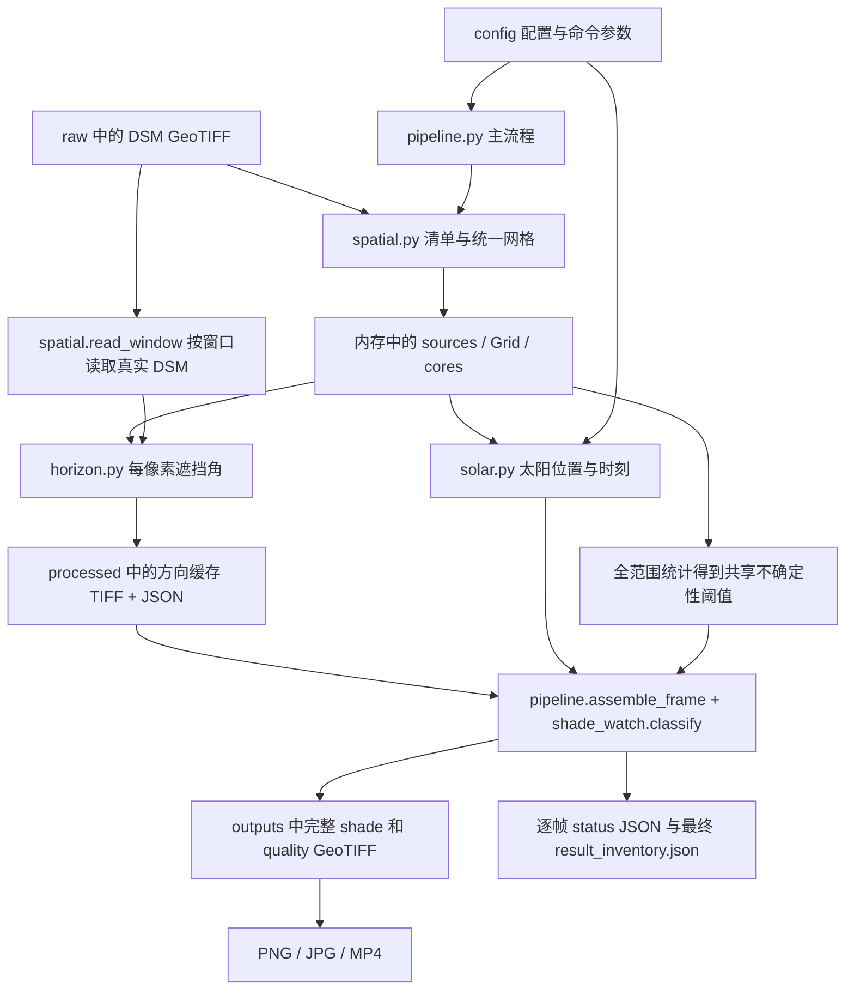

# Shade Watch HK：从文件夹到计算结果的架构说明

核对日期：2026-10-01。以下按当前代码与已完成的六 tile 运行整理；文件名中的 20260929 是运行目录标识，实际模拟日期是 2026-01-07。

2026-10-02 补充：六块独立运行现已完成，结果位于 `outputs/individual_6tiles_20261001/`。新增 `src/batch_tiles.py` 负责逐块运行和计时，`--tile` 可按准确源文件名选择单块；每块采用自身原生边界和几何中心。命令、输出结构及实测耗时见[分别运行原生 tile](RUN_INDIVIDUAL_TILES.md)。下文的合体图示例及其共享太阳参考点仍适用于 native_mosaic 模式。

## 1. 根目录、原始输入与完整目录树

项目的根目录是 `/Volumes/My Passport for Mac/Projects/shade_watch_hk/`。`Projects/` 是它的上一级；`heat_index_urop` 不属于本项目。如果“最底层”指原始数据所在的位置，当前真正进入计算的是 `data/raw/dsm/2020/D12.DSM.TIFF/`。

```text
shade_watch_hk/
├── README.md                         项目入口、运行方式与结果说明
├── requirements.lock.txt             Python 依赖版本
├── .gitignore                       排除原始数据、缓存、结果和本地环境
├── .git/                            本项目的 Git 历史与远端设置
├── .venv/                           本机 Python 运行环境
├── config/                          用户提供的运行条件
│   ├── study_area.md                原始位置、模拟日期，以及人工说明
│   ├── processing.json              默认单 tile 运行配置
│   └── mosaic_6tiles.json           六 tile 合体运行配置
├── data/
│   ├── raw/                         原始输入
│   │   ├── dsm/
│   │   │   ├── Terms and Conditions of Use.pdf
│   │   │   └── 2020/
│   │   │       ├── D12.DSM.TIFF/     当前使用的 19 份 .tif，及配套 .tfw
│   │   │       ├── D16.DSM.ERS/      另一种下载格式，当前主流程不使用
│   │   │       ├── D20.DSM.PIX/      另一种下载格式，当前主流程不使用
│   │   │       └── Metedata for LiDAR Data (2020).html
│   │   ├── validation/             UAV 照片等观测资料，目前不参与生产计算
│   │   └── basemap/                预留底图位置，目前没有参与计算的底图
│   └── processed/
│       └── horizon_cache_1km/       可跨日期复用的遮挡角缓存
│           └── <horizon_key>/      一组相同输入、网格和算法的缓存
│               ├── definition.json
│               ├── .cache.lock
│               ├── c0_r0_w1500_h1200_az215.tif
│               ├── c0_r0_w1500_h1200_az215.json
│               └── …其他核心与方向的 TIFF/JSON 对
├── src/                             执行计算的 Python 文件
│   ├── shade_watch.py              命令入口，以及配置解析、分类、PNG 等共用函数
│   ├── pipeline.py                 当前主流程：调度、缓存、续算、拼接、导出
│   ├── spatial.py                  图幅清单、坐标网格、范围、窗口读取与统计
│   ├── horizon.py                  每个像素沿指定方向计算遮挡角
│   ├── solar.py                    日出日落、采样时刻、太阳方位角与高度角
│   ├── verify_chunking.py          分块、内存、续算等数值 QA 工具
│   └── verify_mosaic.py            六 tile 合体与单一区域参考的比较工具
├── outputs/                         每次运行的科学结果、展示文件与运行记录
│   ├── native_mosaic_6tiles_1km_20260929/   当前六 tile 示例
│   ├── native_tile_unit_1km_20260928/       之前的单 tile、单任务结果
│   ├── native_tile_1km_20260928/            更早的单 tile、四任务结果
│   ├── chunking_qa_20260928/                之前的数值验证与性能记录
│   ├── 600x450/                            历史自定义范围结果
│   ├── baseline/、validation_capture/      历史试验/检查文件
│   ├── update_backups/                     改造前源码备份
│   └── 顶层旧 TIFF/PNG/JPG/MP4/JSON 等      历史结果，不代表最新六 tile 运行
├── tests/                           自动测试代码
│   ├── test_core.py                 坐标、太阳角度、分类与计算核心检查
│   └── test_chunking.py             核心边界、缺数据、并行、缓存与拼接检查
├── docs/                            方法、验证、架构与历史研究说明
├── references/                      Shade Watch.pdf 等研究参考资料
└── web/index.html                   历史 600×450 m 结果的本地浏览页面
```

`__pycache__/`、`.pytest_cache/` 是 Python/Numba/测试生成的缓存；`.DS_Store` 是 macOS 文件夹信息；`.gitkeep` 是早期保留空目录用的占位文件。它们不定义阴影计算。

根目录下的文件夹是按用途并列组织的。程序不会依次把整个 `config/`、`data/`、`src/` 文件夹“执行一遍”；真正连接这些文件的是 `pipeline.py` 中的函数调用。

## 2. 用户实际输入什么

| 用户输入 | 放在哪里 | 谁读取 | 影响什么 |
| --- | --- | --- | --- |
| DSM 高程栅格 | `data/raw/dsm/2020/D12.DSM.TIFF/*.tif` | `spatial.inventory()` 和 `spatial.read_window()` | 地表高程、遮挡、缺数据、原生 tile 边界 |
| 原始经纬度与模拟日期 | `config/study_area.md` | `shade_watch.load_study_area()` | 选择默认 tile、确定模拟日期；custom 无覆盖中心时用这个位置 |
| 输出模式、范围大小、并行数、预算、输出路径 | `config/processing.json`，或 `--config` 指定的 JSON | `pipeline.main()` | 如何组织和运行任务 |
| 六个输出 tile 的文件名 | `config/mosaic_6tiles.json` 的 `native_tile_names` | `pipeline.resolve_output()` → `spatial.native_mosaic_grid()` | 合体图范围 |
| 自定义中心、尺寸等命令参数 | 运行命令 | `pipeline.main()` | 覆盖本次 JSON 中对应的设置 |

**目前 `study_area.md` 真正被解析的字段只有 Centre latitude、Centre longitude、Simulation date。** 文档中的其他段落是说明和记录，并不是全部都会自动成为程序参数。

时区目前写在 `solar.py` 中，为 Asia/Hong_Kong；10 分钟间隔写在 `pipeline.py` 中；5° 方位分箱与 0.25 m 射线采样也由代码定义。默认 1 km 搜索和 1 km 缓冲既出现在配置中，也由主流程检查为固定的模型条件，不能只随意改 JSON 就切换成其他距离。

DSM 的实际读取目录目前由 `shade_watch.py` 中的 `RAW` 常量指定，主流程只扫描该目录直接包含的 `*.tif`。把新数据放到其他年份/子目录，并不会自动被发现。供应方 HTML 元数据、使用条款 PDF、论文和 UAV 照片没有在每次生产运行中被自动解析为计算参数。

默认运行：

```sh
.venv/bin/python -m src.shade_watch
```

六 tile 示例：

```sh
.venv/bin/python -m src.shade_watch --config config/mosaic_6tiles.json
```

程序先读 JSON，再应用命令行覆盖值。默认单 tile 输出采用原生边界和几何中心；六 tile 输出采用六个原生图幅的联合范围和联合几何中心。原始配置位置作为选择点保留。

## 3. 从输入到最终图片的主流程



### 第一步：入口读取配置

`python -m src.shade_watch` 进入 `shade_watch.py` 的 `run()`，随后调用 `pipeline.main()`。当前完整的生产调度在 `pipeline.py`；`shade_watch.py` 同时保留分类等共用函数和部分历史兼容函数。

`pipeline.main()` 读取 JSON，处理命令参数，然后调用 `run()`。`run()` 检查输出路径、预算相关设置、搜索/缓冲条件，并给输出目录加锁。

### 第二步：从 DSM 的 metadata 建立全局网格

`spatial.inventory()` 打开每个 TIFF，读取宽高、像元尺寸、坐标系、坐标变换、地理边界、NoData 值，并计算文件 SHA-256。主流程也记录 Rasterio 报告的外部掩膜/辅助文件身份（存在时）。

这里生成的是内存中的 `records` 清单；当前不会先写一份独立的 `source_inventory.json` 再读回来。相同清单之后会被写入运行说明、缓存说明和最终结果索引中。

清单交给 `target_grid()` 或 `native_mosaic_grid()`，得到一个覆盖整个输出的 `Grid`。`Grid` 包含整个输出的宽、高、坐标变换、坐标系及选中的源文件等信息。然后 `cores()` 按统一网格生成互不重叠的核心窗口。

六 tile 示例的全局网格是 3000×3600 像素，核心是 1500×1200；核心地址如 `[0,0,1500,1200]`、`[1500,0,1500,1200]`。其含义依次是“起始列、起始行、列数、行数”，不是米。

### 第三步：确定共享太阳条件和质量条件

`region_stats()` 以小窗口扫描整个输出及其外扩范围，统计有效像素、高程最小/最大值。`pipeline.py` 据此计算一个共用的不确定性阈值。这个统计来自实际 DSM 像素值，不是仅靠 TIFF 文件头就能获得。

`output_reference()` 确定输出几何中心；`solar.py` 接收中心经纬度和模拟日期，得到日出日落、10 分钟采样时刻及各时刻的太阳角度。

这些数据在当前运行内直接通过变量传递，并没有独立的 `solar.json` 或 `threshold.json` 中间文件。最终会汇入 `result_inventory.json`。整个合体范围的所有核心共享太阳参数和阈值。

### 第四步：计算并保存可复用的方向缓存

`pipeline.execute()` 管理任务顺序/并行度，`process_core()` 处理一个核心的全部所需方向。开启多进程时，先运行一个真实核心测内存，校准通过才启动并行调度。

`process_core()` 先调用 `valid_cache()` 检查已有缓存。需要计算时，`spatial.read_window()` 读取核心及每侧 1 km 的实际 DSM；当前 1500×1200 核心对应 5500×5200 缓冲数组。源文件一次打开一个，读取窗口上限为 512×512。

随后 `horizon.pixel_centred_horizon()` 对核心内的每个像素沿指定方向搜索，输出三个数组，存为一个三波段 GeoTIFF：

| 波段 | 含义 | 后续用途 |
| --- | --- | --- |
| 1：known_horizon_degrees | 该像素朝此方向的最大已知遮挡仰角 | 与太阳高度比较 |
| 2：complete_ray_support_0_or_1 | 此方向的 1 km 搜索是否有完整 DSM 支持 | 判断是否有足够依据认定日照 |
| 3：maximum_blocker_sample_distance_m | 产生最大遮挡坡度的采样距离 | 数值 QA 与诊断；生产分类目前不直接读取这一波段 |

它们存入 `data/processed/horizon_cache_1km/<horizon_key>/`。这里的 horizon 是遮挡角信息，还不是某个时刻的最终阴影标签。

缓冲区只提供周围遮挡物。缓存 TIFF 只写核心目标像素，因此相邻核心可以读取重叠地形，却不会重复写同一输出像素。

### 第五步：按时刻生成 shade 和 quality

`pipeline.assemble_frame()` 针对一个时刻，使用 `nearest_bin()` 把太阳方位选到最近 5° 方向，逐核心读取对应缓存的前两波段，再调用 `shade_watch.classify()`。

分类输入为：遮挡角、完整支持标记、地表是否有效、当时太阳高度、共享不确定性阈值。输出为两个 uint8 数组：

| 文件 | 数值含义 |
| --- | --- |
| `rasters/shade_*.tif` | 1 阴影；0 日照；255 无效或不确定 |
| `quality/quality_*.tif` | 0 有效；1 地表 DSM 缺失；2 搜索支持不足；3 低太阳高度下的远处遮挡敏感性；4 太阳中心低于地平线 |

已知障碍可以证明阴影；不能证明日照的缺数据情况仍保留不确定性。每个核心写入整幅 TIFF 中自己的窗口，最后形成完整合体图。不会把整天所有大数组一起保存在内存里。

### 第六步：生成 PNG、JPG、视频与最终索引

- `export_pngs()` 读取完整 shade TIFF，生成无损标签 PNG。总像素不超过 400 万时输出整幅；超过时按核心分片，并写坐标 JSON。
- PNG 的灰度通道保存科学编码 0/1/255，alpha 保存有效性。它不能当成普通黑白展示图直接解释；展示时还要把 0 映射为白、1 映射为黑、无效映射为灰。
- `render_frame()` 读取 shade TIFF，按预览分辨率生成黑/白/灰图片及图例。JPG 和 MP4 共用这一展示结果，MP4 不是从已经保存的 JPG 再拼出来的。
- 当前 JPG 选最接近 14:30 的日照采样时刻；MP4 为 4 fps。导出后解码验证帧数。
- 最后写 `result_inventory.json`，汇总所有帧路径、角度、统计、网格、源数据、缓存位置、耗时和内存等信息。

## 4. 一次运行的 outputs 内部有什么

以 `outputs/native_mosaic_6tiles_1km_20260929/` 为例：

```text
native_mosaic_6tiles_1km_20260929/
├── run_definition.json              开始时保存：本次运行的输入与定义
├── parallel_calibration.json        首个真实任务的内存/耗时记录
├── task_events.jsonl                每完成一个核心追加一行任务记录
├── .run.lock                        避免两次运行同时写这个目录
├── rasters/                         65 份完整阴影标签 GeoTIFF
├── quality/                         65 份配套质量 GeoTIFF
├── status/                          65 份逐时刻完成状态、路径、统计与校验和
│   └── 20260107_1430.json
├── png/                             390 片无损 PNG，每片有同名坐标 JSON
│   ├── shade_20260107_1430_HKT_c0_r0.png
│   ├── shade_20260107_1430_HKT_c0_r0.json
│   └── …
├── shade_20260107_1430_HKT.jpg       代表时刻展示图
├── shade_daylight_2026-01-07_HKT.mp4  全天展示视频
├── result_inventory.json            整次运行完成后的总索引
└── qa/                             后续验证工具产生，不由正常主流程自动完成
    ├── single_region_115.tif        同范围作为一个核心的参考计算
    ├── single_region_180.tif
    ├── single_region_215.tif
    ├── single_region_225.tif
    ├── reference.json              参考计算记录
    ├── reference_215.json           当时额外补充 215° 参考的记录
    ├── comparison.json             逐像素比较结果
    └── video_preview_1430.jpg       视频解码画面检查样本
```

正常生产主流程不自动执行 `verify_mosaic.py`，也不自动写出全部这些 QA 文件；它们是随后独立验证得到的。

## 5. metadata 究竟被谁读、用来做什么

metadata 是“解释数据、定位数据、核对数据身份或记录执行状态的信息”。在这里它既可能藏在 GeoTIFF 内部，也可能是内存中的对象，或单独保存为 JSON。

| metadata 所在位置 | 谁生成 | 当前谁读取 | 实际作用 |
| --- | --- | --- | --- |
| 原始 GeoTIFF 内部的 CRS、transform、尺寸、NoData | 数据供应方 | `spatial.inventory()`、Rasterio 窗口读取 | 定位源像素、检查兼容性、定义原生网格 |
| 供应方 HTML、条款 PDF、`.tfw` | 数据供应方 | 人工检查；TIFF 由 Rasterio 打开 | HTML/PDF 不会被主流程自动解析；没有自写的 `.tfw` 解析阶段，当前采用 Rasterio 读出的网格信息 |
| 内存 `records`、`Grid`、`core_layout` | `spatial.py` 和 `pipeline.py` | 后续读取、计算、写出函数 | 同一次运行内直接传递坐标与输入信息，无须先存 JSON 再读 |
| `run_definition.json` | `pipeline._run_locked()` | 同函数在再次运行时读取 `key`；`verify_mosaic.py` 读取 `identity.grid` 和 `identity.sources` | 防止不同科学输入覆盖同一结果目录；让 QA 重建完全相同的输入和输出网格 |
| 缓存目录 `definition.json` | `pipeline._run_locked()` | 当前生产复用时不靠重新读取它来决定有效性 | 完整说明该缓存身份；身份在本次运行内重新计算，再对照单任务 JSON/TIFF |
| 缓存 `<core>_azNNN.json` | `process_core()` | `valid_cache()` | 检查完成状态、缓存键、核心地址、方向和 TIFF 校验和，决定复用还是重算 |
| 缓存 TIFF 的坐标/波段/tags | `process_core()`、`profile()` | `valid_cache()`、`assemble_frame()`、验证工具 | 自定位；核对缓存；读取真正的遮挡数值 |
| `status/YYYYMMDD_HHMM.json` | `assemble_frame()` | `output_valid()`，由 `assemble_frame()` 调用 | 检查本帧条件和两个输出 TIFF 的校验和；通过后复用，并返回已有帧统计 |
| `result_inventory.json` | 主流程完成时生成 | `verify_mosaic.py`、`verify_chunking.py` 的生产对比模式；人工检查 | 找到缓存、核心尺寸、阈值、每帧太阳角度及 shade/quality 路径；当前生产续算并不以它作为主要检查点 |
| PNG 的同名 `.json` | `export_pngs()` | 供后续 GIS/自写拼接程序使用；当前主流程与旧网页不会自动读它 | 给 PNG 补上 CRS、坐标变换、全局窗口地址和编码说明 |
| `parallel_calibration.json` | 并行前的校准步骤 | 当前程序不从这个旧文件恢复校准判断 | 保存测量证据；准入判断用本次测量在内存中的结果 |
| `task_events.jsonl` | 调度循环逐行追加 | 人工检查；当前续算不以它判定缓存有效 | 核心完成数量、复用/计算数量、耗时与内存日志 |
| `qa/reference.json`、`comparison.json` | 验证工具 | 人工检查 | 参考计算性能与数值差异报告，正常生产不把差异报告再喂回算法 |

锁文件只用于互斥；存在一个 `.lock` 文件不等于仍有进程持锁。临时文件先写完再重命名，JSON 中的完成状态、文件结构和校验和共同决定结果是否有效。

## 6. 三种 key 的区别

SHA-256 在这里相当于文件或一组设置的内容指纹。程序利用它来区分“名字相同”和“内容确实相同”。

| 名称 | 由什么决定 | 出现在哪里 | 用途 |
| --- | --- | --- | --- |
| `horizon_key` / 缓存 key | 算法版本、`horizon.py` 与 `spatial.py` 文件内容、源文件身份、完整输出网格、搜索/缓冲、采样和缺数据规则 | `<horizon_key>/` 目录名；缓存任务 JSON；TIFF 的 `cache_key`；最终索引 | 确定遮挡缓存属于哪套空间输入 |
| 运行定义的 `key`（代码变量 `run_key`） | horizon key、日期、空间参考、分类代码与太阳代码身份 | `run_definition.json` | 阻止不兼容运行写进同一输出目录 |
| 帧状态的 `key`（代码变量 `frame_key`） | horizon key、具体时间、太阳参数、共享阈值 | `status/*.json` | 判定这一时刻的 shade/quality 是否仍可复用 |

注意一个现有命名细节：shade GeoTIFF 的 `run_key` tag 当前实际保存的是 horizon key；它与 `run_definition.json` 的运行 key 不是同一个值。读取时以表中的文件位置和代码含义为准，不要仅按字段名字判断。

日期不在 horizon key 中，所以同一空间条件下换日期可复用已有方向；新日期需要的额外方向仍要计算。换日期也必须使用新的结果目录。改变 worker 数不会改变遮挡缓存身份。改变核心尺寸时，实际窗口尺寸进入缓存文件名和任务校验，所以只有完全匹配的窗口缓存才可复用。

当前缓存身份也包含源文件绝对路径、全局网格等；移动项目位置或改变输出范围，可能导致生成新的缓存身份。当前机制不保证“同一个原生 tile 在任意合体范围中都自动共享同一缓存”。所有被扫描的源文件都进入身份记录，哪怕某个文件没有与本次某一核心相交。

## 7. 用 14:30 这一帧把文件串起来

1. 读取 `config/mosaic_6tiles.json` 和 `config/study_area.md`，确定六个输出 tile、2026-01-07，以及 3 个 worker。
2. 读取 19 份源 TIFF 的 metadata，构建 3000×3600 的统一网格、六个核心和联合几何中心；保存 `run_definition.json`。
3. 用真实 DSM 与相同网格生成各方向缓存。六个核心、27 个方向，对应 162 份三波段 TIFF 和各自的状态 JSON。
4. `solar.position()` 算出 14:30 太阳方位约 215.452°、视高度约 36.294°。`nearest_bin()` 选择 215°。
5. `assemble_frame()` 依次读取六份 `*_az215.tif` 的前两波段，结合 36.294° 与共享阈值调用 `classify()`。
6. 核心结果写入完整的 `rasters/shade_20260107_1430_HKT.tif` 和 `quality/quality_20260107_1430_HKT.tif`，同时写 `status/20260107_1430.json`。
7. 从完整 shade TIFF 导出六片 PNG 和六份坐标 JSON，再生成 14:30 JPG 与视频中的对应一帧。
8. 全天结束后，`result_inventory.json` 的 `frames` 保存这一帧的文件路径、角度、数量和校验信息。
9. `verify_mosaic.py compare` 读取 `run_definition.json` 重建网格，再读 `result_inventory.json` 找到缓存、阈值及逐帧结果，用 `qa/single_region_215.tif` 作参考，输出 `qa/comparison.json`。

这条链中，`result_inventory.json` 确实成为后续 QA 程序的输入；而 PNG 坐标 JSON 目前只是给后续使用者准备的数据接口，没有自动接入网页。

## 8. 当前网页、历史代码与版本管理的边界

`web/index.html` 仍明确读取 `../outputs/600x450/result_inventory.json`，再依据旧索引中的 `frame.png` 读取 PNG。它不会自动扫描 `outputs/`，也没有接入新的六 tile 索引或分片 PNG。新旧索引结构不同，不能只替换目录名就认定页面可以展示新结果。

`shade_watch.py` 中还存在旧的 600×450 常量和历史辅助函数；正常入口已经交给 `pipeline.py`，因此那些常量并不控制当前默认原生 tile 的输出大小。类似地，`horizon.py` 中保留了其他诊断函数，当前生产使用的是 `pixel_centred_horizon()`。

代码、配置、测试和说明文档进入 Git。原始 DSM、论文、观测照片、缓存、运行结果、`.venv` 等由 `.gitignore` 排除。因此从 GitHub 克隆代码后，还需放入本地数据并准备运行环境，才能重新计算；仓库本身不包含已生成的六 tile 大文件。

当前默认配置指向 `outputs/native_tile_geometric_1km_20260929/`，2026-10-01 检查时该目录尚未生成；已完成的合体示例在 `outputs/native_mosaic_6tiles_1km_20260929/`，随后完成的六块独立示例在 `outputs/individual_6tiles_20261001/`。应从运行配置的 `output_directory` 和实际的 `result_inventory.json` 判断某次运行，而不是只查看 `outputs/` 顶层或旧的输出说明。
